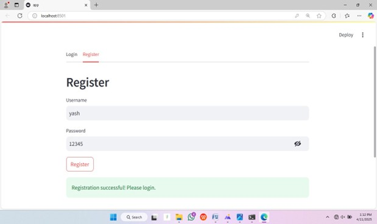
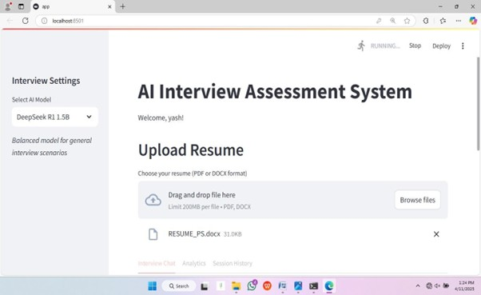

# 🧠 AI Interview Assessment System

An intelligent, interactive interview simulator that analyzes candidate performance using AI-generated questions, real-time chat, and personalized analytics. Built with Streamlit, this platform leverages language models and sentiment analysis to evaluate both **technical** and **behavioral** skills.

---

## 🚀 Features

- 🔐 **User Authentication** (Register/Login with secure JSON storage)
- 📄 **Resume Parsing** (PDF to text extraction)
- 🤖 **AI-Powered Question Generation** using LLMs (DeepSeek, LLaMA 2, Mistral)
- 🗣️ **Chat-Based Interview Interface** with response tracking
- 📊 **Performance Analytics**:
  - Response time
  - Answer length
  - Sentiment analysis
  - Keyword matching
  - Technical accuracy
- 🧾 **Session Recording & History**
- 💡 **Personalized Feedback & Recommendations**

---

## 🧱 Project Structure

📁 AI_Interview_Assessment/

├── app.py # Main Streamlit application  
├── analytics_utils.py # Candidate response analysis module  
├── session_recorder.py # Session tracking & history manager  
├── model_config.py # LLM configuration and prompt handling  
├── users.json # User credentials (insecure - use DB in production)  

---

## 🛠️ Technologies Used

- **Python 3.10+**
- **Streamlit** (UI & interactivity)
- **TextBlob** (sentiment analysis)
- **Ollama** (for LLM model inference)
- **PyPDF2** (resume parsing)
- **NumPy, JSON, Regex** (data handling & logic)

---

## 🧪 How It Works

1. **User Login/Register**
2. **Upload Resume (PDF)**
3. **AI analyzes resume** → generates custom questions
4. **Interactive chat** between user and AI
5. **System records** every Q&A, tracks timing
6. **Analytics Engine** provides detailed performance report
7. **Session history** viewable for reflection and improvement

---

## 🔍 Sample Use Case

- A user uploads their resume.
- The system generates interview questions using the selected model.
- The user answers each question in a chat format.
- Behind the scenes, each response is analyzed for:
  - Timeliness
  - Sentiment
  - Keyword relevance
  - Technical strength
- At the end, the system provides recommendations to improve.

---

## 🧠 Example: Analyzed Metrics

| Metric               | Description                               |
|----------------------|-------------------------------------------|
| Avg Response Time    | Measures how fast the candidate replies   |
| Sentiment Score      | Detects positivity/negativity in tone     |
| Keyword Match Rate   | Checks alignment with question context    |
| Technical Accuracy   | Scores based on domain-specific keywords  |

---

## 📦 Setup Instructions

1. Clone the repository  
      git clone https://github.com/<your-username>/ai-interview-assessment.git  
      cd ai-interview-assessment

2. Install dependencies  
      pip install -r requirements.txt

3. Run the app  
      streamlit run app.py

🛡️ Notes & Limitations
User data is stored in users.json – not secure for production

Interview sessions are stored in the interview_sessions/recordings/ directory

Ollama must be locally set up and models (e.g., deepseek, llama2, mistral) available

Resume upload must be in PDF format

🤝 Contributions Welcome!
If you'd like to improve model logic, add dashboards, or enhance UX, feel free to fork and PR.

📜 License
MIT License – free to use, modify, and distribute.

👨‍💻 Developed By
Vasavi
GitHub Profile
📧 vasavi9354@gmail.com

## 📊 Results

### Result 1

### Result 2

